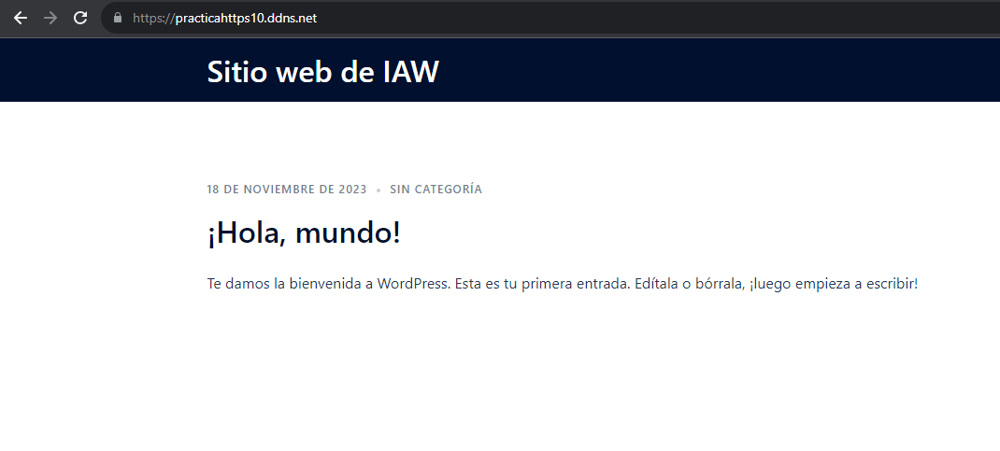
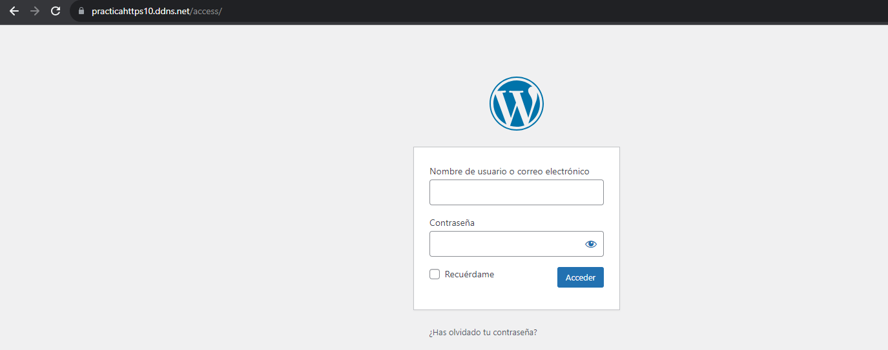

# Practica_9.-Arquitectura en dos niveles.
### Aquí hemos contado con la creación de una pila lamp, la cual contiene linux (S.O), apache, mysql, php:

Donde, como base de la pila lamp vamos a instalar wordpress, desde la raiz hasta en un directorio propio.
#

### Con esto, buscamos hacer un despligue de aplicaciones.

# Muestra todos los comandos que se han ejeutado.
```
set -ex
```
<p>Se interrumpe el script si hay algún fallo a lo largo de la ejecución del código</p>

# Actualización de repositorios
```
 sudo apt update
```
# Actualización de paquetes
# sudo apt upgrade  

# Instalamos el servidor Web apache
```
apt install apache2 -y
```
### Con esto instalamos el servidor web apache2.

### Estructura de directorios del servicio apache2.

```
 1. Directorios
  1.1 conf-available --> donde se aplican los hosts virtuales.
  1.2 conf-enabled --> donde se encuentran enlaces simbolicos a los archivos de configuracion           
  de conf-available.
  1.3 mods-available --> para añadir funcionalidades al servidor.
  1.4 mods-enabled --> enlaces simbolicos a esas funcionalidades.
  1.5 sites-available --> archivos de configuración de hosts virtuales.
  1.6 sites-enabled --> enlaces simbolicos a sites-available.
 2. Ficheros
  2.1 apache2.conf --> Archivo de configuración principal.
  2.3 envvars --> Define las variables de entorno, que se usan en el archivo principal.
  2.3 magic --> Para determinar el tipo de contenido, por defecto es MIME.
  2.4 ports.conf --> archivo donde se encuentran los puertos de escucha de apache.
```

### En /etc/apache2 se almacenan los archivos y directorios de apache2.

## Contenido del fichero /conf/000-default.conf.
Este archivo contiene la configuración del host virtual el cual debe contener las siguientes directivas para que funcione la aplicación web.

En la ruta del repositorio ``/conf/000-default.conf``, encontramos la configuración que se emplea para este despliegue.

```python
ServerSignature Off
ServerTokens Prod
<VirtualHost *:80>
    #ServerAdmin webmaster@localhost
    DocumentRoot /var/www/html
    DirectoryIndex index.php index.html 
    
    <Directory "/var/www/html/">
        AllowOverride All
    </Directory>

    ErrorLog ${APACHE_LOG_DIR}/error.log
    CustomLog ${APACHE_LOG_DIR}/access.log combined
</VirtualHost>
```
Aquí podemos comprobar lo que contiene el fichero de configuración del ``VirtualHost``, donde todas las conexiones pasaran por el puerto 80, el ``DocumentRoot``, donde mostrará el contenido será desde ``/var/www/html`` y podemos ver los archivos de error y acceso para comprobar errores y ver quien ha accedido, Tambien, tenemos la directiva ``Directory index`` la cual establece una prioridad en el orden que se establezca.

Podemos comprobar que hemos añadido ``directory`` el cual almacena las directivas asignadas al virtualhost, mas las que se encuentran en el archivo principal de apache. 

La ruta donde se ejecuta el contenido que vamos a mostrar por internet y la directiva ``AllowOverride All`` mas adelante se explica el porque esto está aquí, como información puedo ofrecer que tiene que ver con el archivo ``.htaccess``.

### También se hace uso de las siguientes directivas 
``ServerSignature OFF `` --> Esto es por si nos interesa incorporar la versión de apache, en páginas de error e indice de directorios, lo dejamos en OFF por seguridad. Se debe aplicar a todo el servidor.

``ServerTokens Prod `` --> Esta se puede aplicar a un único servidor virtual. Aquí se muestran información sobre las cabeceras, es decir, respuestas que se mandan al cliente, es conveniente tenerlo quitado.

# Instalar php
```
apt install php libapache2-mod-php php-mysql -y
```
### Instalamos php junto con unos modulos necesarios.
<------------------------------------------------------>
### ``libapache2-mod-php`` --> para mostrar paginas web desde un servidor web apache y ``php-mysql``, nos permite conectar una base de datos de MySQL desde PHP.

# Copiar el archivo de configuracion de apache.
```
cp ../conf/000-default.conf /etc/apache2/sites-available
```
### En este caso, no haría falta emplear el comando ``a2ensite``, ya que se habilita por defecto debido a que apache2 toma por defecto la configuración de ese archivo para desplegar las opciones que hemos hecho en la web.

### Este script posee un archivo de configuración en la carpeta ``conf `` por el cual configura el host virtual que muestra el contenido de la aplicación web.

```
ServerSignature Off
ServerTokens Prod
<VirtualHost *:80>
    #ServerAdmin webmaster@localhost
    DocumentRoot /var/www/html
    DirectoryIndex index.php index.html
    
    <Directory "/var/www/html/">
        AllowOverride All
    </Directory>

    ErrorLog ${APACHE_LOG_DIR}/error.log
    CustomLog ${APACHE_LOG_DIR}/access.log combined
</VirtualHost>
```

# Reiniciamos el servicio apache
```
systemctl restart apache2
```
### Reiniciamos apache para que obtenga los cambios.

# Copiamos el arhivo de prueba de php
### La finalidad de esto va a ser que muestre el contenido de la página index.php la cual se inserta en la carpeta html, con objetivo de que muestre el contenido de esa página, por defecto, si vemos el archivo de configuración de 000-default.conf veremos que:
 <p> DocumentRoot ``/var/www/html`` --> Toma como raiz, los archivos en html.</p>
 <p> ``DirectoryIndex`` --> index.php index.html --> Muestra en orden los archivo situados.</p>    

```
cp ../php/index.php /var/www/html
```
### Sabiendo lo anterior copiamos el archivo index.php a ``/var/www/html``.

# Modificamos el propietario y el grupo del directo /var/www/html
```
chown -R www-data:www-data /var/www/html
```
### Lo que estamos haciendo es que el usuario de apache tenga permisos de propietario sobre, el directorio html con objetivo de que pueda desplegar el **sitio web**.

# Conexiones
<p>Ahora podriamos conectarnos a traves de nuestro navegador a nuestra pagina index.php</p>

```
En el navegador --> http://nuestraipservidor/index.php, y debería salirnos.
```
# 2 Instalación de certbot y sitio web con certificado transmitido por autoridad certificadora.

<p>Pero, ¿Que es una autoridad certificadora? Nos permite que el acceso a nuestro contenido web se cifre y sea seguro, hoy dia no se permite el uso de paginas http sin el protocolo ssl/tls, con el que cifra los datos durante las peticiones.</p>

### Muestra todos los comandos que se han ejecutado.
<p>-- Aparte de que interrumpe el script en caso de errores.</p>

```
set -ex
```
## 1 Actualización de repositorios

```
 apt update
```
<p>Actualizamos los repositorios para que el software se instale correctamente y no de pié a errores durante la ejecución del script.</p>

## 2 Importamos el archivo de variables .env

```
source .env
```

<p>El cual las variables que nos interesan de este archivo son las siguientes:</p>

```
# Variables para el certificado.
CERTIFICATE_EMAIL=demo@demo.es
CERTIFICATE_DOMAIN=practicahttps10.ddns.net
```

<p>Estas son las variables que requerimos para la creación del certificado el cual a traves de una autoridad certificadora de confianza, nos va a secuerizar el contenido, mediante https, cogiendo el dominio que he creado con noip y asignando a ese dominio la ip de la máquina con la que se pretende realizar el despliegue.</p>

Esto se realizará automaticamente con certbot, ya que junto con letsencrypt se encargará el de establecer el certificado seguro.

## 3 Borramos certbot para instalarlo despues, en caso de que se encuentre, lo borramos de apt para instalarlo con snap.
#
```
apt remove certbot
```
Con esto desinstalamos certbot por si se haya en el sistema.

#Instalación de snap y actualizacion del mismo.
```
snap install core
snap refresh core
```
Instalamos y ejecutamos el gestor de paquetes snap, el cual lo necesitamos para instalar certbot.

## 4 Instalamos la aplicacion certbot

```
snap install --classic certbot
```

### Donde --classic hace que dicha aplicación se instale, con una serie de permisos para que forme parte de un entorno seguro y aislado teniendo acceso a recursos del sistema que a lo mejor no podría tener.

## 5 Creamos un alias para la aplicacion certbot

```
ln -sf /snap/bin/certbot /usr/bin/certbot
```

### Creamos un enlace simbólico donde:

```python
ln --> Para crear un enlace en el sistema.
-s --> El tipo de enlace que crea es simbólico.
-f --> Para que lo cree por la fuerza.
```
Tras eso, hemos creado un enlace simbolico en ``/usr/bin`` para que se ejecute una vez lo llamamos, es decir para que se ejecute, es necesario ya que necesitamos que se ejecute para recibir ese certificado de confianza.

## 6 Obtener el certificado.

```
certbot --apache -m $CERTIFICATE_EMAIL --agree-tos --no-eff-email -d $CERTIFICATE_DOMAIN --non-interactive
```

Nosotros si solo insertasemos ``certbot --apache``, lo ejecutaría pero, interrumpería la automatización del script, ya que buscamos que se realice automáticamente, esto se debe a que aparecen asistentes donde hay que insertar una serie de datos.

```python
--apache: Esto significa que da el certificado para apache.
-m: Establecemos la direccion de correo la cual la contiene la variable $CERTIFICATE_EMAIL del archivo .env, se puede cambiar por otra.
--agree-tos: Con esto aceptamos terminos de uso.
--no-eff-email: Con esto no compartimos nuestro email con la EFF.
-d: El dominio que contiene la variable: $CERTIFICATE_DOMAIN.
--non-interactive: Para que declarar que se hace de forma no interactiva. 
```
<p>Una vez que hemos instalado las pilas del frontend y el backend en sus respectivos servidores, hacer un despliegue del backend y frontend en sus respectivas máquinas, hay que tener en cuenta que el frontend no requiere de mysql, al igual que el backend no necesita ni php ni apache, ni nada ya que no sirve de nada que la gente se conecte a la base de datos.</p>

# Instalación del Backend.

### Importante
<p>El script "deploy_backend" debe desplegarse antes del deploy_frontend ya que dara fallo al intentar instalar algo sobre una base de datos que no existe, también hay que tener en cuenta que las instalaciones van por separado, una para el backend otra para el frontend...</p>

<p>Hay que tener en cuenta que no lo vamos a instalar todo en una misma máquina, vamos a trabajar con una arquitectura de dos niveles, una que se muestra a usuarios y otra por debajo (backend), definiendo una base de datos, lo cual tiene sentido, ya que ningún usuario ajeno debe acceder a la información que se aloja en dicha base de datos. Teniendo en cuenta las ips privadas de cada máquina y que para acceder a dicha base de datos se debe hacer a traves de la ip privada, si lo hacemos a traves de la pública exponemos la base de datos.</p>

## Muestra todos los comandos que se han ejecutado.

```
set -ex
```
En caso de error para la ejecución del script.
## Incluimos las variables del archivo .env.

```
source .env
```
<p>Carga las variables en el script</p>

<p>Donde si incluye lo siguiente y lo que vamos a necesitar para desplegar el backend unicamente.</p>

```
WORDPRESS_DB_NAME=wordpress
WORDPRESS_DB_USER=wp_user
WORDPRESS_DB_PASSWORD=wp_pass
IP_CLIENTE_MYSQL=172.31.91.83 --> Ip privada del frontend.
WORDPRESS_DB_HOST=172.31.95.143 --> Ip privada del backend --> para que conecte desde la ip privada y no la pública, para que acceda un usuarios desde dentro de los dos niveles sin interrumpir la seguridad.
```

<p>Donde incluyen las variables con las que se van a construir la base de datos, de forma automática con las instrucciones posteriores.</p>

# Instalamos mysql-server para la máquina backend.

## Actualización de repositorios
 
 ```
 sudo apt update
 ```
Con esto actualizamos los repositorios.  

## Importamos el archivo .env para incorporar las variables que necesitamos.

```
source .env
```

Incorporamos la variable que necesitamos para la instalación.

```
MYSQL_PRIVATE=172.31.95.143
```

Esta variable, incorpora la ip privada del backend, ya que poner la pública sería algo no recomendable de hacer, en la base de datos solo deben trabajar los empleados, lo usuarios que accedan al frontend no deben tener ningún conocimiento sobre el lugar donde reside la base de datos.

## Instalación de mysql-server

```
sudo apt install mysql-server -y
```

Instalamos mysql-server conn el -y para que lo isntale de forma automática.

## Configuración de mysql, para que solo acepte conexiones desde la ip privada.

```
sed -i "s/127.0.0.1/$MYSQL_PRIVATE/" /etc/mysql/mysql.conf.d/mysqld.cnf
```

<p>No nos interesa que mysql se conecte a si mismo, es decir que se redireccione a si mismo mediante el host local, tenemos que poner la ip privada de dicho servidor, que es donde se va a encontrar alojado el servidor de mysql.</p>

## Reiniciamos el servicio.

```
systemctl restart mysql
```
<p>Importante reiniciar el servicio tras ese leve ajuste en el fichero de configuración de mysql.</p>

# Creamos la base de datos para el Backend.

<p>"Aquí es donde ejecutamos el script deploy_backend."</p>
```
mysql -u root <<< "DROP DATABASE IF EXISTS $WORDPRESS_DB_NAME"
mysql -u root <<< "CREATE DATABASE $WORDPRESS_DB_NAME"
mysql -u root <<< "DROP USER IF EXISTS $WORDPRESS_DB_USER@$IP_CLIENTE_MYSQL"
mysql -u root <<< "CREATE USER $WORDPRESS_DB_USER@$IP_CLIENTE_MYSQL IDENTIFIED BY '$WORDPRESS_DB_PASSWORD'"
mysql -u root <<< "GRANT ALL PRIVILEGES ON $WORDPRESS_DB_NAME.* TO $WORDPRESS_DB_USER@$IP_CLIENTE_MYSQL"
```
<p>Con estas instrucciones se crean la base de datos para wordpress desde la máquina backend.</p>

## Reiniciamos el servicio de mysql.

<p>Es necesario reiniciar el servicio para que se asimilen los cambios.</p>

```
systemctl restart mysql 
```

# Instalación del Frontend.  
Aquí solo vamos a atender la instalación de frontend para la máquina en cuestion, la cual va a estar de cara a los clientes que quieran visualizar el contenido, vamos a instalar un wordpress con la herramienta wp-cli.

## Incluimos las variables del archivo .env.

Incorporamos las variables necesarías...
```
source .env
```

-- Estas son las variables de las que dispone el fichero .env.

```
WORDPRESS_DB_HOST=172.31.95.143 --> la cual la hemos cambiado por la ip privada del backend --> esto lo diferencia de la práctica 1.7 que usabamos al localhost.
----------------------------------
wordpress_title="Sitio web de IAW"
wordpress_admin_user=admin
wordpress_admin_pass=admin
wordpress_admin_email=demo@demo.es
```

## Borramos los archivos previos.

--> #### Borramos los archivo de la utilidad wp-cli del directorio tmp. 

```
rm -rf /tmp/wp-cli.phar
```

## Descargamos La utilidad wp-cli

```
wget https://raw.githubusercontent.com/wp-cli/builds/gh-pages/phar/wp-cli.phar -P /tmp
```

Descargamos la utilida de wp-cli que nos permite instalar wordpress con esa herramienta.

## Asignamos permisos de ejecución al archivo wp-cli.phar

```
chmod +x /tmp/wp-cli.phar
```
Damos permisos de ejecución a ese fichero .phar el cual agrupa varios ficheros en uno solo.

## Movemos los el fichero wp-cli.phar a bin para incluirlo en la lista de comandos.

```
mv /tmp/wp-cli.phar /usr/local/bin/wp
```

Lo vemos a la ruta `` /usr/local/bin/wp `` para que wp funcione como un comando integrado en el directorio bin de linux donde se encuentran los comandos del sistema.

## Eliminamos instalaciones previas de wordpress

Eliminamos la instalación de wordpress, del directorio donde html muestra el contenido por internet gracias a apache2.

```
rm -rf /var/www/html/*
```

## Descargarmos el codigo fuente de wordpress en /var/www/html

```
wp core download --path=/var/www/html --locale=es_ES --allow-root
```
Descargamos el codigo fuente de wordpress en el directorio html.

Aquí lo que hacemos es elegir el idioma automaticamente, sin necesidad de ponerlo nosotros.

Con ``core`` nos referimos a el núcleo de WordPress contiente los archivos principales de WordPress que permiten hacer cosas como: Acceder al panel de administración de WordPress. Agregar y editar publicaciones y páginas. Administrar usuarios.

```
--path=/var/www/html --> Con esto designamos la ruta donde descargar todo el codigo fuente de wordpress.
--locale=es_ES --> Con esto configuramos el idioma de descarga.
--allow-root --> Y lo importante, tenemos que permitir que el root ejecute dicha instalación si no, presentará errores.
```

## Creación del archivo wp-config 

Creación del archivo wp-config.

```
wp config create \
  --dbname=$WORDPRESS_DB_NAME \
  --dbuser=$WORDPRESS_DB_USER \
  --dbpass=$WORDPRESS_DB_PASSWORD \
  --dbhost=$WORDPRESS_DB_HOST\
  --path=/var/www/html \
  --allow-root
```

Aquí, se configura la base de datos el cual se menciona al usuario en cuestión, su contraseña y el nombre de la base de datos 
de wordpress.

## Instalamos wordpress.

```
wp core install \
  --url=$CERTIFICATE_DOMAIN \
  --title="$wordpress_title" \
  --admin_user=$wordpress_admin_user \
  --admin_password=$wordpress_admin_pass \
  --admin_email=$wordpress_admin_email \
  --path=/var/www/html \
  --allow-root
```

Con esto instalamos el core de wordpress.
```
Donde contiene lo siguiente:
  --url=$CERTIFICATE_DOMAIN \ --> La variable la cual almacena nuestro dominio por el cual desplegamos nuestra aplicación web.
  --title="$wordpress_title" \ --> El titulo que le hemos puesto a nuestra pagina wordpress.
  --admin_user=$wordpress_admin_user \ --> El nombre de inicio de sesión.
  --admin_password=$wordpress_admin_pass \ --> La contraseña de inicio de sesión.
  --admin_email=$wordpress_admin_email \ --> El email...
  --path=/var/www/html \ --> la ruta donde se encuentra wordpress instalado.
```
Lo que estamos haciendo aquí es lo mas parecido a una instalación desatendida, olvidando el hecho de que tengamos que configurar wordpress tras la instalación, del mismo.

## Actualizamos el core

```
wp core update --path=/var/www/html --allow-root
```

Actualizamos el core, para evitar problemas a la hora de instalar plugins.., temas.., etc.

## Instalamos un tema:

```
wp theme install sydney --activate --path=/var/www/html --allow-root
```

Con este comandos, instalamos un tema el cual se necesita incorporar la ruta donde tenemos el wordpress --> /var/www/html, con --allow-root para que se inicie como root.

## Instalamos el plugin bbpress:

Aquí instalamos un plugin con la siguiente sentencia...

```
wp plugin install bbpress --activate --path=/var/www/html --allow-root
```

Donde lo activamos en el proceso de instalación.

## Instalamos el plugin para ocultar wp-admin

Y lo mas importante es ocultar nuestro login de wordpress a los usuarios de internet para evitar, ciertas consecuencias.

```
wp plugin install wps-hide-login --activate --path=/var/www/html --allow-root
```

Se cambia por defecto a login...

## Habilitar permalinks

```
 wp rewrite structure '/%postname%/' \
  --path=/var/www/html \
  --allow-root
```

Con esto realizamos un rewrite, ya que es necesario que para que las paginas ganen cierta fama para google, con objetivo de mejorar el seo, añadimos esto para que en las url aparezcan nombres en vez de parametros inconclusos.

## Modificamos automaticamente el nombre que establece por defecto el plugin wpd-hide-login

Primero que nada, podemos ver las opciones de wordpress con el siguiente comando, ya que nos interesa cambiar la opción del plugin que hemos instalado anteriormente, lo que vamos a hacer será modificar el nombre por defecto, a uno nuestro, ya que sigue siendo inseguro dejar ese por defecto.

```
wp option list --path /var/www/html --allow-root
```

Con esto vemos todas las listas de opciones incluyendo plugins, temas, etc, instaladas en nuestro wordpress.

```
wp option update whl_page $WORDPRESS_HIDE_LOGIN --path=/var/www/html --allow-root
```

Y con esto, he usado una variable, que incluye el dato que yo quiero insertar a esa opcion para que puede acceder al login con el nombre que le he dado.

# Copiamos el archivo .htaccess a /var/www/html

Copiamos el fichero htaccess asegurandonos de que en el archivo 000-default.conf se encuentra la directiva allowoverride All.

```
cp ../conf/.htaccess /var/www/html
```

Aquí lo muestro:
```
ServerSignature Off
ServerTokens Prod
<VirtualHost *:80>
    #ServerAdmin webmaster@localhost
    DocumentRoot /var/www/html
    DirectoryIndex index.php index.html

    <Directory "/var/www/html/">
        AllowOverride All
    </Directory>
    
    ErrorLog ${APACHE_LOG_DIR}/error.log
    CustomLog ${APACHE_LOG_DIR}/access.log combined
</VirtualHost>
```

## Habilitamos la modalidad de reescritura.

```
a2enmod rewrite
```
Habilitamos la modalidad rewrite para que se reescriban y nos permitan manipular las urls a antojo accediendo a diferentes urls.

## Cambiamos al propietario de /var/www/html como www-data

```
chown -R www-data:www-data /var/www/html
```
Cambiamos el propietario del directorio wordpress para que el usuario de apache pueda ejecutarlo.

# Comprobaciones de funcionamiento.
<p>Aquí se va a comprobar el funcionamiento de lo que se realizado previamente, de lo mas importante.</p>

## Comprobación de que funciona el dominio.

Como podemos comprobar, tanto el dominio, como la reescritura, como el contenido seguro de la página por el certificado funcionan. 
## Comprobacion de que funciona el cambio de la opción login.
Ahora toca comprobar si ha cogido bien la variable que actualiza la palabra con la que iniciamos sesión al dashboard de wordpress.

Como se puede comprobar, si, lo ha modificado.